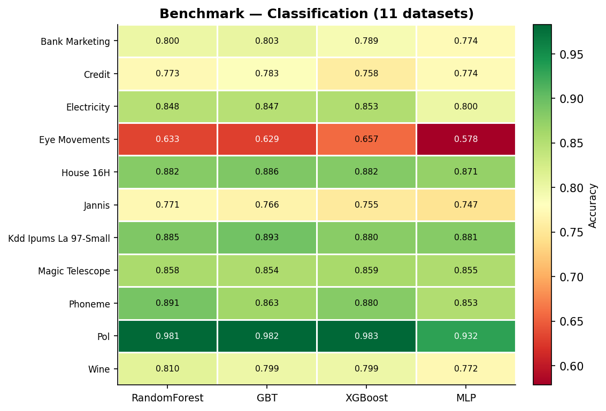
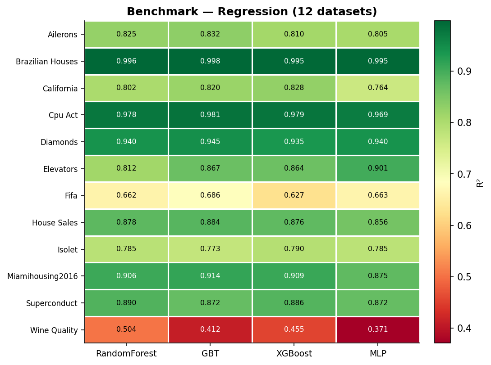
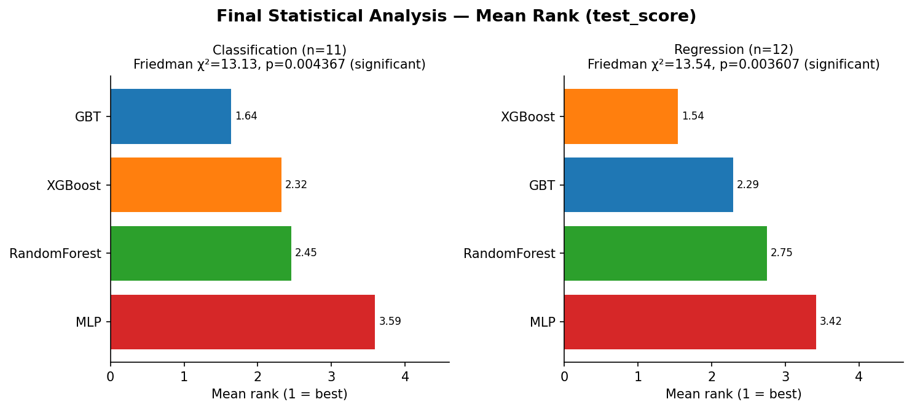
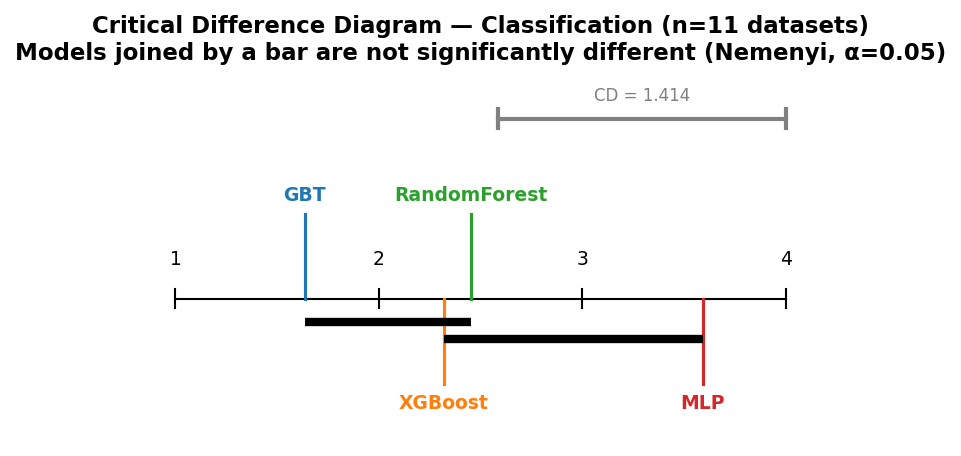
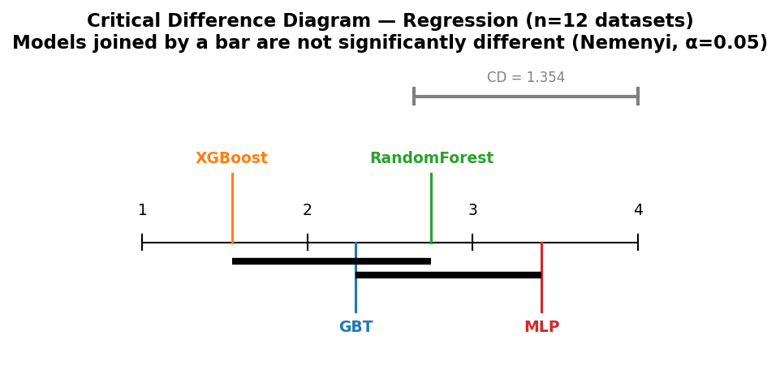
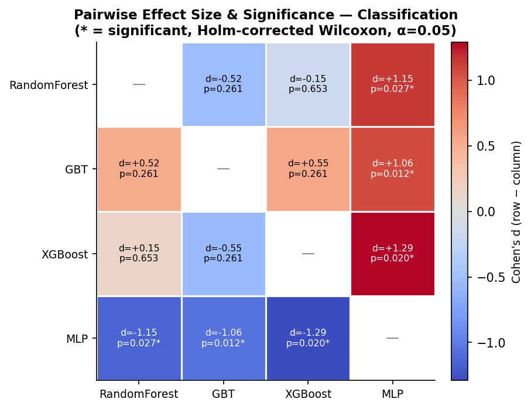
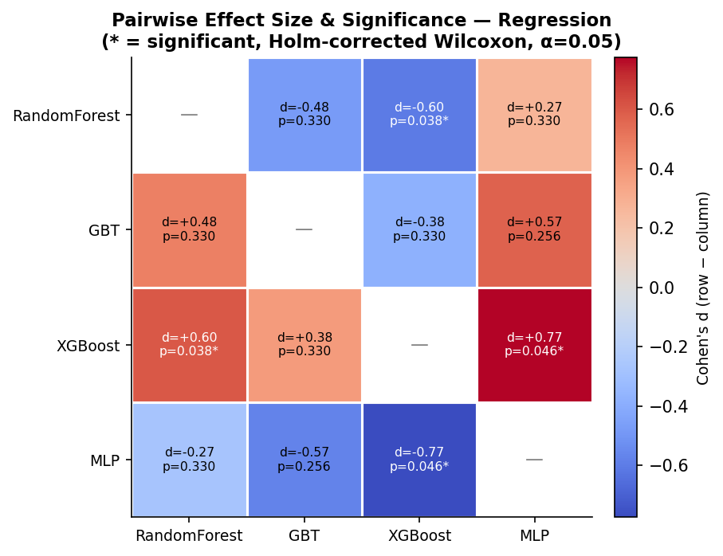

# Tabular Benchmark Reproduction

Partial replication and extension of:

> Grinsztajn, L., Oyallon, E., & Varoquaux, G. (2022). *Why do tree-based models still outperform deep learning on tabular data?* arXiv:2207.08815

---

## Overview

This project reproduces and extends the core empirical comparison from the paper above: tree-based models (Random Forest, Gradient Boosted Trees, XGBoost) against a multilayer perceptron (MLP), on tabular classification and regression tasks.

Beyond a plain benchmark comparison, this project adds:

- **23 OpenML datasets** (11 classification, 12 regression), expanded from an initial set of 13 through a documented incremental process
- **Paper-sourced hyperparameter search spaces** (Appendix A.3) with randomized search tuning
- **5-fold cross-validation** as a robustness check alongside the tuned held-out test score
- **Formal statistical testing** (Friedman, Nemenyi, Wilcoxon with Holm correction, Cohen's d) comparing the four models
- Two supplementary experiments from the paper: sensitivity to uninformative (noise) features, and sensitivity to random feature-space rotation

This is a CPU-only, scikit-learn/XGBoost-based reproduction — not a reimplementation of the paper's own (PyTorch-based) codebase.

## Results

The benchmark and statistical analysis are summarized below. The full set of figures is available in the [`figures/`](figures/) directory.

### benchmark





### Statistical analysis











---

## Datasets (23)

All datasets are fetched from OpenML by fixed `data_id` (`config.py`), capped at 10,000 rows if larger (`MAX_SAMPLES`), with rows containing missing values dropped first. Shapes below are the reference values used by `data_loader.py`'s load-time validation (`EXPECTED_SHAPES`); the actual row count after missing-value filtering may be slightly lower than the OpenML original.

### Classification (11)

| Dataset | OpenML ID | Reference shape (rows × features) |
|---|---|---|
| bank_marketing | 44126 | 10,578 × 7 |
| credit | 44089 | 16,714 × 10 |
| electricity | 44120 | 38,474 × 7 |
| eye_movements | 44130 | 7,608 × 20 |
| house_16H | 44123 | 13,488 × 16 |
| jannis | 44131 | 57,580 × 54 |
| kdd_ipums_la_97-small | 44124 | 5,188 × 20 |
| magic_telescope | 44125 | 13,376 × 10 |
| phoneme | 44127 | 3,172 × 5 |
| pol | 44122 | 10,082 × 26 |
| wine | 44091 | 2,554 × 11 |

### Regression (12)

| Dataset | OpenML ID | Reference shape (rows × features) |
|---|---|---|
| Ailerons | 44137 | 13,750 × 33 |
| Brazilian_houses | 44141 | 10,692 × 8 |
| california | 44025 | 20,640 × 8 |
| cpu_act | 44132 | 8,192 × 21 |
| diamonds | 44140 | 53,940 × 6 |
| elevators | 44134 | 16,599 × 16 |
| fifa | 44026 | 18,063 × 5 |
| house_sales | 44144 | 21,613 × 15 |
| isolet | 44135 | 7,797 × 613 |
| MiamiHousing2016 | 44147 | 13,932 × 13 |
| superconduct | 44148 | 21,263 × 79 |
| wine_quality | 44136 | 6,497 × 11 |

The 10 datasets `pol` through `Brazilian_houses` (`config.NEW_DATASETS`) were added after the original 13-dataset benchmark. Results from the two batches are combined via `merge_new_results.py` (see [Repository Structure](#repository-structure)).

---

## Models & Preprocessing

Four models, defined in `models.py`:

- **RandomForest** (scikit-learn)
- **GBT** — GradientBoostingTrees (scikit-learn)
- **XGBoost**
- **MLP** — scikit-learn's `MLPClassifier` / `MLPRegressor`

Preprocessing (`data_loader.py`):

- 70/30 train/test split, stratified for classification (`TEST_SIZE=0.3`, `MASTER_SEED=42`)
- Categorical features one-hot encoded (fit on train, applied to test); tree models receive these features directly
- MLP additionally receives `QuantileTransformer(output_distribution="normal")`-Gaussianized features, fit on train only

> **Not independently re-verified for this README:** whether any of the 10 later-added datasets contain categorical features. `hyperparameter_spaces.py` documents that plain GBT (rather than HistGradientBoostingTrees) was chosen because the original 13 datasets are numerical-only, per the paper's own dataset tracks — whether that justification still holds across all 23 has not been rechecked here.

---

## Experiments

### Benchmark (`benchmark.py`)

Untuned baseline: each model fit once per dataset with default hyperparameters (`BENCHMARK_N_ESTIMATORS=300` for tree ensembles), evaluated once on the held-out test set. Output: `benchmark_results.csv`.

### Hyperparameter Tuning (`tune.py`)

- `RandomizedSearchCV`, `TUNING_N_ITER=50` iterations per (dataset, model)
- Search spaces sourced from the paper's Appendix A.3 (Tables 3, 5, 6, 7), implemented in `hyperparameter_spaces.py`. Random Forest, GBT, and XGBoost match the paper's specification exactly, modulo documented sklearn/XGBoost API naming differences (e.g. `deviance` → `log_loss`). The MLP space is a documented partial adaptation: scikit-learn's MLP has no dropout or learning-rate-scheduler parameter, so those two paper-specified search dimensions are excluded rather than approximated.
- Validation split: `TUNING_VAL_FRACTION = 9/70` of the training pool, carved out with a dedicated seed (`TUNING_VAL_SPLIT_SEED=501`), held fixed across all 4 models per dataset. The test set is never touched during search.
- Best hyperparameters are refit on the full training pool and evaluated once on the test set.
- Supports `--datasets all` / `--datasets new`, with resume/skip: rerunning a partially completed job detects and skips datasets with complete results, and discards/reruns any dataset left partially complete by an interruption.
- Output: `tuning_results.csv` / `tuning_results_new.csv`.

### Cross-Validation (`cv.py`)

- 5-fold CV (`CV_N_FOLDS=5`): `StratifiedKFold` for classification, `KFold` for regression, on the 70% training pool only — the test set is never referenced.
- Uses the **frozen** hyperparameters from tuning (no re-search); this is not nested CV.
- For MLP, a fresh `QuantileTransformer` is fit per fold, on that fold's training rows only, to avoid leaking validation rows into the transform.
- A **supplementary robustness estimate** alongside the single tuned test score — not a replacement for it.
- Same `--datasets` / resume-skip support as `tune.py`.
- Output: `cv_fold_results.csv` (per fold), `cv_results.csv` (per-dataset aggregate), plus `_new` variants.

### Merging (`merge_new_results.py`)

Concatenates the original-13 and new-10 result sets into `tuning_results_merged.csv`, `cv_results_merged.csv`, `cv_fold_results_merged.csv`, after checking for duplicate `(dataset, model)` keys across the two halves.

---

## Findings 2 & 3

Both experiments use **GBT and MLP only** — hardcoded in `finding2.py`/`finding3.py` as the tree/non-tree representatives; RandomForest and XGBoost are intentionally not included here.

- **Finding 2** (`finding2.py`): random Gaussian noise features appended at levels `[0, 5, 10, 20, 50]`, averaged over 5 seeds, measuring change from each dataset's own noise=0 baseline. Output: `finding2_results.csv`.
- **Finding 3** (`finding3.py`): features Gaussianized, then passed through 10 random orthogonal rotations (`special_ortho_group`), each evaluated across 3 model-initialization seeds, comparing rotated vs. original performance. Output: `finding3_results.csv`.

> The current numeric contents of `benchmark_results.csv`, `finding2_results.csv`, and `finding3_results.csv` (after the full 23-dataset run) were not independently re-verified for this README. The figures listed under [Figures](#figures) are the source of record for these results.

---

## Statistical Analysis (`stats.py`)

Comparison of the four models' **test_score** (from `tuning_results_merged.csv`), classification and regression analyzed separately. The statistical unit is one score per (dataset, model) — CV fold scores are never treated as independent observations. A secondary sensitivity check repeats the same analysis on `cv_results_merged.csv`'s 5-fold mean score.

For each task: Friedman test (omnibus), mean rank per model, Nemenyi post-hoc critical difference, all 6 pairwise Wilcoxon signed-rank tests (Holm-corrected), and paired Cohen's d (d_z).

### Results (primary analysis, test_score)

**Classification** (n=11 datasets) — Friedman χ²=13.13, p=0.0044

| Model | Mean rank | Mean test_score |
|---|---|---|
| GBT | 1.64 | 0.8355 |
| XGBoost | 2.32 | 0.8283 |
| RandomForest | 2.45 | 0.8269 |
| MLP | 3.59 | 0.8079 |

**Regression** (n=12 datasets) — Friedman χ²=13.54, p=0.0036

| Model | Mean rank | Mean test_score |
|---|---|---|
| XGBoost | 1.54 | 0.8519 |
| GBT | 2.29 | 0.8481 |
| RandomForest | 2.75 | 0.8374 |
| MLP | 3.42 | 0.8235 |

Both Friedman tests reject the null of equal mean ranks at α=0.05.

### Pairwise comparisons

Holm-corrected Wilcoxon signed-rank test, α=0.05. Cohen's d_z is positive when the first-listed model's scores were higher on average across datasets.

**Classification** — 3 of 6 pairs reach significance, all involving MLP:

| Pair | d_z | Wilcoxon p (Holm) | Significant |
|---|---|---|---|
| RandomForest vs GBT | −0.52 | 0.261 | No |
| RandomForest vs XGBoost | −0.15 | 0.653 | No |
| RandomForest vs MLP | +1.15 | 0.027 | Yes |
| GBT vs XGBoost | +0.55 | 0.261 | No |
| GBT vs MLP | +1.06 | 0.012 | Yes |
| XGBoost vs MLP | +1.29 | 0.020 | Yes |

**Regression** — 2 of 6 pairs reach significance:

| Pair | d_z | Wilcoxon p (Holm) | Significant |
|---|---|---|---|
| RandomForest vs GBT | −0.48 | 0.330 | No |
| RandomForest vs XGBoost | −0.60 | 0.038 | Yes |
| RandomForest vs MLP | +0.27 | 0.330 | No |
| GBT vs XGBoost | −0.38 | 0.330 | No |
| GBT vs MLP | +0.57 | 0.256 | No |
| XGBoost vs MLP | +0.77 | 0.046 | Yes |

Nemenyi critical difference: 1.414 (classification, k=4, n=11), 1.354 (regression, k=4, n=12). The Nemenyi procedure — a stricter, simultaneous-comparison correction — distinguishes fewer pairs than Holm-corrected Wilcoxon in this data; see `fig6_critical_difference_*.png` for which pairs it flags. This difference between the two procedures is expected, not a discrepancy.

### CV sensitivity check

The mean-rank **ordering** of the four models from the CV `mean_score` matched the ordering from the primary `test_score` exactly, in both task types (classification: GBT, XGBoost, RandomForest, MLP; regression: XGBoost, GBT, RandomForest, MLP; both ascending by mean rank). Most pairwise significance results also replicated. One exception: RandomForest vs. XGBoost reached significance in the primary regression analysis (Holm p=0.038) but not in the CV sensitivity check (Holm p=0.107). Full CV results: `stats_summary_cv.csv`, `stats_pairwise_cv.csv`.

---

## Repository Structure

```
.
├── config.py                   # dataset registry, seeds, hyperparameter constants
├── data_loader.py               # OpenML fetch, preprocessing, train/test split
├── models.py                    # RF / GBT / XGBoost / MLP definitions
├── hyperparameter_spaces.py     # paper-sourced search spaces
├── experiment_utils.py          # shared logging / incremental CSV writer
│
├── benchmark.py                  → benchmark_results.csv
├── tune.py                       → tuning_results.csv, tuning_results_new.csv
├── cv.py                         → cv_results.csv, cv_fold_results.csv (+ _new)
├── merge_new_results.py          → *_merged.csv
├── finding2.py                   → finding2_results.csv
├── finding3.py                   → finding3_results.csv
├── stats.py                      → stats_summary.csv, stats_pairwise.csv (+ _cv)
│
├── visualize.py                  → figures/fig1-4_*.png
├── stats_visualize.py            → figures/fig5-7_*.png
│
├── figures/
├── openml_cache/                 # created at runtime, gitignored
└── README.md
```

---

## Reproducibility & Run Order

### Requirements

Python 3.11+, plus: `numpy`, `pandas`, `scipy`, `scikit-learn`, `xgboost`, `matplotlib`. These six are the only packages this project's code actually imports.

### Seeds

Separated by role rather than a single global seed (`config.py`): `MASTER_SEED` (data splits, transforms, model init), `TUNING_VAL_SPLIT_SEED`, `TUNING_SEARCH_SEED`, `CV_FOLD_SEED`.

### Run order

```bash
python data_loader.py                    # validates all 23 datasets load correctly

python benchmark.py

python tune.py --datasets all
python tune.py --datasets new
python cv.py --datasets all
python cv.py --datasets new
python merge_new_results.py

python finding2.py
python finding3.py

python stats.py
python visualize.py
python stats_visualize.py
```

`tune.py` and `cv.py` support resuming an interrupted run: rerunning the same command detects datasets with complete results and skips them, while safely discarding and rerunning any dataset left partially complete by the interruption.

---

## Figures

The following figures are generated by the visualization scripts. Selected figures are embedded above; all generated figures are listed here.


Produced by `visualize.py`:

- `fig1_benchmark_classification.png` / `fig1_benchmark_regression.png` — per-dataset, per-model score heatmap
- `fig2_benchmark_mean_rank.png` — mean rank from untuned benchmark scores
- `fig3_finding2_classification.png` / `_regression.png` — noise sensitivity
- `fig4_finding3_classification.png` / `_regression.png` — rotation sensitivity

Produced by `stats_visualize.py`:

- `fig5_stats_mean_rank.png` — tuned mean rank with Friedman annotation
- `fig6_critical_difference_classification.png` / `_regression.png` — Nemenyi CD diagrams
- `fig7_pairwise_effects_classification.png` / `_regression.png` — pairwise Cohen's d / significance heatmaps


---

## Limitations vs. the Original Paper

- 23 datasets vs. the paper's 45+
- scikit-learn's `MLPClassifier`/`MLPRegressor` used in place of the paper's PyTorch MLP; consequently the MLP search space omits dropout and learning-rate scheduling (both paper-specified, neither available in scikit-learn's API)
- No transformer-based tabular models (the paper's other neural baselines)
- CPU-only throughout (not independently re-confirmed for the larger later-added datasets, e.g. jannis at 57,580 rows or superconduct at 21,263 rows, but no evidence to the contrary)
- `RandomizedSearchCV` uses 50 iterations per (dataset, model); the paper's own search budget is larger
- Whether any of the 10 later-added datasets contain categorical features (relevant to the GBT-vs-HistGradientBoostingTrees choice documented in `hyperparameter_spaces.py`) has not been rechecked against the paper's numerical-only justification for the original 13

Unlike the original 3-dataset version of this project, results here are backed by a formal statistical analysis (Friedman / Nemenyi / Wilcoxon / Cohen's d) rather than qualitative observation alone.

---

## References

Grinsztajn, L., Oyallon, E., & Varoquaux, G. (2022). *Why do tree-based models still outperform deep learning on tabular data?* https://arxiv.org/abs/2207.08815

Original benchmark repository: https://github.com/LeoGrin/tabular-benchmark