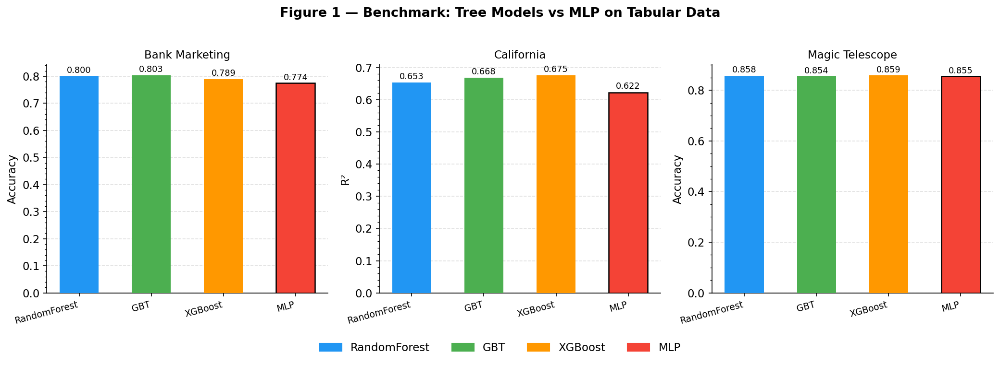
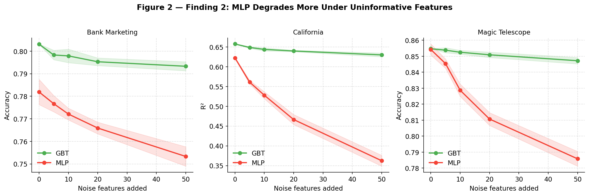
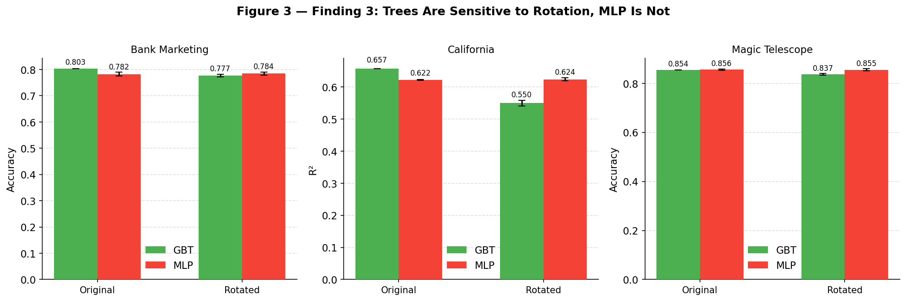

# Why Do Tree-Based Models Still Outperform Deep Learning on Tabular Data?

### A Lightweight Reproduction Study

This project is a partial reproduction of the paper:

> Grinsztajn et al. (2022) — *Why do tree-based models still outperform deep learning on tabular data?*
> https://arxiv.org/abs/2207.08815

---

## Overview

Tree-based models such as Gradient Boosting Trees and Random Forests often outperform deep learning models on structured tabular datasets, despite the success of deep learning in domains like computer vision and NLP.

This project reproduces the core benchmark and two empirical findings from the paper using a lightweight experimental setup based on:

* scikit-learn
* XGBoost
* three real-world OpenML datasets

The goal is not to exactly reproduce the original paper, but to validate several of its central observations under a smaller and more computationally accessible setting.

---

## Datasets

All datasets are part of the OpenML benchmark suite used in the original paper.

| Dataset            | Task           | Samples | Features |
| ------------------ | -------------- | ------- | -------- |
| Bank Marketing     | Classification | 10,000  | 7        |
| California Housing | Regression     | 10,000  | 8        |
| Magic Telescope    | Classification | 10,000  | 10       |

For consistency with the paper, datasets were capped at 10,000 samples.

---

## Models

### Tree-Based Models

* Random Forest
* Gradient Boosting Trees (GBT)
* XGBoost

### Neural Network

* Multi-Layer Perceptron (MLP)

---

## Preprocessing

The preprocessing pipeline follows the methodology described in the paper:

* Tree models receive raw tabular features
* MLP models receive Gaussianized features using `QuantileTransformer`
* Classification datasets use stratified train/test splits
* All experiments use a fixed 70/30 train/test split

For the rotation experiment, both models receive the same Gaussianized input in order to isolate the effect of feature rotation.

---

# Experiments

## 1. Benchmark (`benchmark.py`)

This experiment compares all four models on the three datasets using standard supervised learning metrics.

### Main Observation

Tree-based models generally outperform or match the MLP on these tabular datasets.

* On **Bank Marketing** and **California Housing**, tree ensembles achieve the best performance.
* On **Magic Telescope**, the performance gap is much smaller, consistent with the original paper's observation that neural networks can become competitive on certain datasets.



---

## 2. Sensitivity to Uninformative Features (`finding2.py`)

This experiment reproduces one of the paper's central findings:

> Neural networks are more sensitive to irrelevant input features than tree-based models.

We progressively add random Gaussian noise features:

[
0,\ 5,\ 10,\ 20,\ 50
]

and measure the degradation in performance for:

* Gradient Boosting Trees (GBT)
* MLP

Results are averaged across 5 random seeds, and standard deviations are reported.

### Main Observation

MLP performance degrades substantially faster as irrelevant features are added.

For example, on **California Housing**:

* MLP:
  [
  R^2: 0.622 \rightarrow 0.362
  ]

* GBT:
  [
  R^2: 0.657 \rightarrow 0.630
  ]

This reproduces the paper's conclusion that tree-based methods are significantly more robust to uninformative features.



---

## 3. Rotation Sensitivity (`finding3.py`)

This experiment investigates rotational invariance.

Features are first Gaussianized and then transformed using random orthogonal rotation matrices generated with:

```python
scipy.stats.special_ortho_group
```

The experiment compares model performance before and after rotation.

Results are averaged across:

* 10 random rotations
* 3 model initialization seeds

### Main Observation

Tree-based models are highly sensitive to feature rotation, while MLP performance remains nearly unchanged.

For example, on **California Housing**:

* GBT:
  [
  R^2: 0.657 \rightarrow 0.550
  ]

* MLP:
  [
  R^2: 0.622 \rightarrow 0.624
  ]

This supports the paper's hypothesis that tree-based methods exploit the natural axis-aligned structure of tabular data, whereas MLPs are approximately rotation-invariant.

Interestingly, on **Magic Telescope**, the rotated MLP slightly outperforms GBT, matching the qualitative behavior reported in the original paper.



---

# Running the Project

## Install Dependencies

```bash
pip install scikit-learn xgboost matplotlib scipy pandas numpy
```

## Run Experiments

```bash
python benchmark.py
python finding2.py
python finding3.py
python visualize.py
```

Place the `.arff` dataset files in the project directory before running the experiments.

---

# Project Structure

```text
project/
│
├── data_loader.py
├── benchmark.py
├── finding2.py
├── finding3.py
├── visualize.py
│
├── benchmark_results.csv
├── finding2_results.csv
├── finding3_results.csv
│
├── fig1_benchmark.png
├── fig2_finding2.png
├── fig3_finding3.png
│
└── README.md
```

---

# Key Takeaways

* Tree-based ensembles remain highly competitive on tabular datasets
* MLPs are substantially more sensitive to irrelevant features
* Tree models rely strongly on axis-aligned feature structure
* MLPs are comparatively rotation-invariant
* The reproduced findings are consistent across multiple random seeds and rotations

---

# Limitations

This is a lightweight reproduction and differs from the original paper in several ways:

* Only 3 datasets are used instead of 45
* Hyperparameter tuning is limited
* Only MLPs are evaluated among neural architectures
* Computational scale is much smaller than the original benchmark

Therefore, the results should be interpreted as qualitative reproductions rather than exact replications.

---

# Reference

Grinsztajn, L., Oyallon, E., & Varoquaux, G. (2022).
*Why do tree-based models still outperform deep learning on tabular data?*
arXiv:2207.08815
